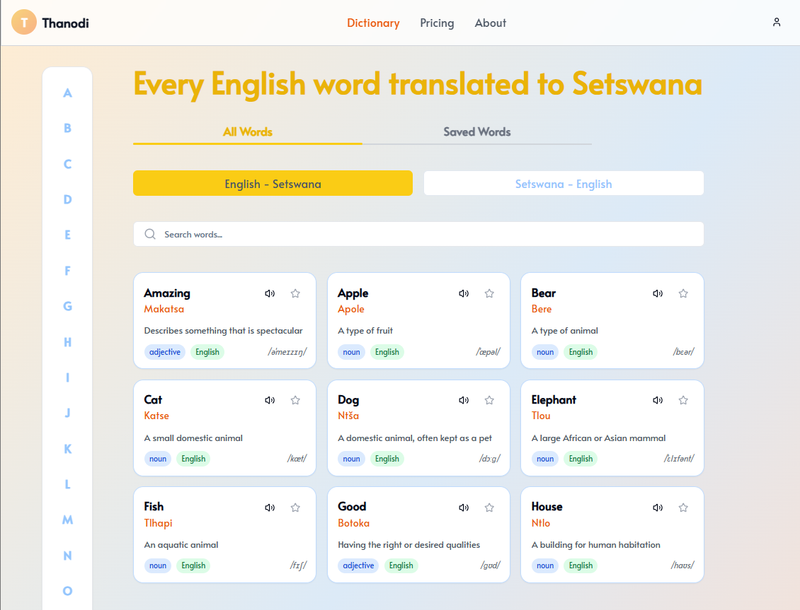

# Setswana-English Online Translator

As a Setswana speaker, many of my peers and I often have to buy physical dictionary books which is often not ideal, time consuming and inconvenient. In addition, since the language of Setswana which is spoken in the country of Botswana is not well documented due to how small the population of its speakers are, many online translators such as Google Translate often make errors when translating between English and Setswana. Noticing all of these issues, I bought several Setswana-English dictionaries from my country and decided to program an online Setswana-English translation website.

## 🚀 Project Overview
The website is designed to make Setswana-English translation accessible, reliable, and modern.

## 🛠️ Tech Stack
- **Framework**: Next.js
- **Database**: MongoDB
- **Storage**: Cloudinary (for audio file storage)
- **APIs**: Google Text-to-Speech API → English word pronunciation
- **Authentication**: Kinde Auth
- **Payments**: Stripe

✨ This project aims to preserve and promote the Setswana language by leveraging modern web technologies.

## Features
- Word search and translation
- Audio pronunciation
- User authentication
- Premium subscription model
- Dictionary page with visual interface
- Cloudinary integration for audio storage
